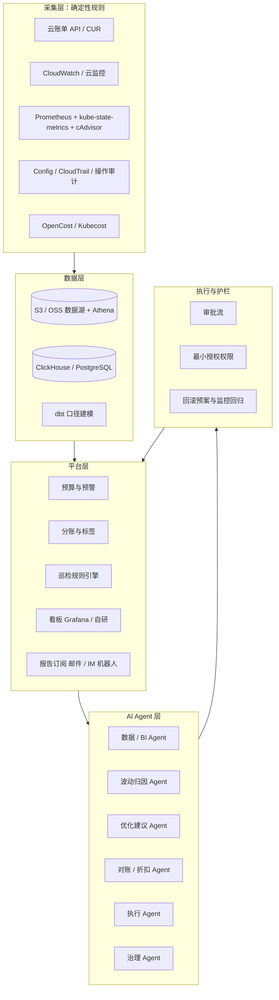

# FinOps 平台工具栈与 AI Agent 化设计：从指标采集到智能治理

> 结合「成本分析」产品手册与《云成本节省方法论》（`00-cloud-cost-saving-methodology.md`）整理。核心结论：**技术指标采集必须走确定性工具（规则 / API），AI Agent 不是替代采集，而是叠加在数据层之上做「理解、归因、建议、执行、学习」**。规则负责确定性与兜底，Agent 负责判断力与效率。

## 一、先分层：FinOps 需要哪些技术指标

### 1. 成本 / 账单类指标

金额是成本治理的第一类指标：应付金额、实付金额、消耗金额（按日分摊）、月 / 年同期环比、预算执行率、折扣与优惠。

| 云厂商 | 工具 |
| --- | --- |
| AWS | Cost Explorer API、CUR（S3 + Athena）、Budgets API、Billing Conductor |
| 阿里云 | 分账账单导出、BSS OpenAPI（如 QueryAccountBill）、成本分析 |
| 腾讯云 | 计费账单 API、成本分账 |
| 华为云 | 账单 API、成本中心 |

统一做法：账单明细落 S3/OSS 数据湖，再用 ClickHouse / PostgreSQL 建模，口径（应付 / 实付 / 分摊 / 环比）在建模层统一。

### 2. 资源资产类指标

实例数量、规格、地域、付费方式、标签、资源组、变更历史——回答「我们有什么、归谁、什么付费模式」。

| 云厂商 | 工具 |
| --- | --- |
| AWS | Config、Resource Groups & Tag Editor、EC2/ECS Describe API、Organizations |
| 阿里云 | Config、资源目录、标签服务 |
| 通用 | Terraform state（IaC 资产清单）、云厂商资源 API |

### 3. 利用率 / 性能类指标

CPU、内存、网络、磁盘 IO、吞吐——RightSize、机器画像、启停策略的数据基础。

- 云原生指标：CloudWatch（AWS）、云监控（阿里云 / 腾讯云 / 华为云）。
- 内存 / 磁盘等需安装 Agent：CloudWatch Agent、云监控 Agent。
- 跨云统一：Prometheus + 自研 exporter 抓取各云监控 API，统一标签与采集频率。

### 4. 容器（K8s）细粒度指标

CPU / 内存 request / limit / usage、Namespace 归属、节点与超卖、PV / 系统盘 / 数据盘。

- kube-state-metrics：集群对象状态（request、limit、副本数、Namespace）。
- metrics-server / cAdvisor：节点与容器实时用量。
- Prometheus：指标存储与查询（PromQL）。
- OpenCost（CNCF 开源）或 Kubecost：K8s 成本分摊、节省建议、Namespace 消耗核算。

### 5. 事件 / 审计类指标

谁在什么时候创建 / 删除 / 修改了资源——波动归因和 AI 解释的关键上下文。

- AWS CloudTrail、阿里云操作审计（ActionTrail）、腾讯云审计、华为云 CTS。
- 配置变更事件可对接自研事件引擎，与账单变动关联。

### 6. 业务类指标

调用量、QPS、SLO、促销周期——把「成本为什么涨」和「业务是否值得」关联起来。

- APM（SkyWalking / 厂商 APM）、Prometheus/Grafana、业务日志。

## 二、结合「成本分析」产品手册的模块映射

| 产品手册模块 | 依赖的数据 / 指标 | 对应工具 |
| --- | --- | --- |
| 数据底座（多云接入） | 账单 + 实例 + AK/SK 采集 | 云厂商 API 采集器 + S3/CUR + 数据量完整性校验 |
| 消费 / 趋势 / 构成分析 | 分摊金额、环比 | 账单明细入 ClickHouse + dbt 建模 + Grafana / Metabase |
| 波动分析 | 新增/存续/减少、用量/单价 | 账单明细 + CloudTrail / 操作审计 + 实例 API |
| 预算与预警 | 预算执行、阈值 | AWS Budgets / 阿里云预算 + 自研事件引擎 |
| 分账 | 标签、资源组 | Cost Allocation Tags / Tag Explorer + 分账规则 |
| 云服务器优化 | CPU/内存利用率、价格 | CloudWatch / 云监控 + 价格 API（Pricing API） |
| K8s 优化 | request/usage、Namespace、节点 | Prometheus + kube-state-metrics + OpenCost / Kubecost |
| 对账折扣 | 官网价、优惠、抹零 | 账单 API + 价格 API + 对账规则 |
| 巡检 | 规则触发、事件 | AWS Config / 自研规则引擎 + 事件通知 |
| 报告推送 | 报表内容 | 报表服务 + 邮件 / 飞书 / 企业微信 / 钉钉机器人 |

## 三、平台总体架构

各层职责：

- **采集层**：只做确定性的数据获取与完整性校验，不引入 AI 判断。
- **数据层**：明细 + 汇总两级存储；dbt 统一口径（应付 / 实付 / 分摊 / 环比），保证任何上层看到的是同一套数字。
- **平台层**：预算、分账、巡检、看板、报告订阅，规则化的确定性能力。
- **AI Agent 层**：在平台层之上做归因、建议、报告、执行。
- **执行与护栏**：审批、最小授权、回滚、监控回归，与《云成本节省方法论》的「可逆可控」原则对齐。

## 四、AI Agent 化设计

### 1. 原则：规则兜底，Agent 增强

- 阈值告警、预算预警、巡检规则等**确定性判断留在规则引擎**——快、可解释、不出错。
- Agent 负责规则做不了或太耗人的部分：波动归因、异常解释、优化建议生成、自然语言查账、报告撰写、变更执行。

### 2. 五类 Agent

| Agent | 职责 | 输入 / 工具 |
| --- | --- | --- |
| 数据 / BI Agent | 自然语言查账（NL2SQL / NL2PromQL） | 账单库、ClickHouse、Prometheus |
| 波动归因 Agent | 分析两期差额，归因到 新增/存续/减少 × 用量/单价 | 账单明细 + 审计事件 + 实例 API |
| 优化建议 Agent | 生成 RightSize / Spot / 预留 / 架构迁移 / K8s request 调整建议，测算节省并按风险分级 | 利用率指标 + 价格表 + 画像；K8s 场景可产出 YAML patch |
| 对账 / 折扣 Agent | 核对应享未享折扣、抢占式优惠真实性、平均折扣偏差 | 账单 + 价格 API + 合同折扣表 |
| 执行 Agent | 将已审批的建议转为 Terraform / 云 API 变更并执行，执行后监控回归 | 审批流 + IaC + 云 API + 监控指标 |
| 治理 Agent | 自动生成周跟踪报告、季度复盘草稿；预算预警时主动分析原因并给措施 | RAG 知识库 + 平台数据 + 通知渠道 |

### 3. 工程底座

- **LLM + function calling / MCP**：Agent 通过工具访问 SQL 库、云 API、PromQL、OpenCost 数据，而不是把数据灌进上下文。
- **编排框架**：LangGraph、OpenAI Agents SDK、Dify 或自研；需要多 Agent 协作时（归因 → 建议 → 执行）用图式编排 + 状态机。
- **RAG 知识库**：pgvector / Milvus，喂 runbook、历史变更记录、厂商产品文档、内部评审结论。
- **权限模型**：只读 Agent 用最小授权账号；执行 Agent 单独角色，所有变更过审批流。
- **评测闭环**：用历史问题集回放（例如已知波动案例、已知折扣漏享案例），验证 Agent 归因与建议的准确率，防止幻觉给出错误优化。

### 4. 安全与护栏（呼应「可逆可控」）

- 建议默认只读展示；变更必须审批。
- 执行选低峰窗口，先备份，留回滚预案，执行后监控回归。
- 预算上限是硬护栏：Agent 生成的变更不得绕过预算与预警机制。
- 高风险动作（删资源、升版本、架构迁移）默认人工执行，Agent 只做方案与验证辅助。

## 五、落地路线（MVP）

1. **采集**：账单 API + CloudWatch / 云监控 + Prometheus + kube-state-metrics + OpenCost。
2. **建模**：ClickHouse / PostgreSQL + dbt，统一口径（应付 / 实付 / 分摊 / 环比）。
3. **展示**：Grafana 出占比、趋势、机器画像、预算执行。
4. **AI 只读先行**：先做波动归因 Agent + 自然语言查账，跑通评测集再扩展。
5. **再上执行**：优化建议 → 审批流 → 执行 Agent（Terraform / 云 API）→ 回滚与监控回归。
6. **最后治理**：周报 / 季度复盘自动生成，巡检规则与 Agent 策略随复盘迭代。

## 六、落地检查清单

- [ ] 账单明细采集（含分摊与环比口径）
- [ ] 资源资产与标签采集（一二级部门分账）
- [ ] 利用率指标采集（1-3 个月，含峰值）
- [ ] K8s 指标（request/usage/Namespace/节点/存储）
- [ ] 事件审计接入（CloudTrail / 操作审计）
- [ ] 统一建模库 + 成本看板
- [ ] 预算 + 阈值预警 + 事件通知
- [ ] AI 波动归因通过历史案例评测
- [ ] 执行 Agent：审批流 + 回滚预案 + 监控回归
- [ ] 季度复盘与规则 / Agent 策略迭代

## 七、相关文档

- [云成本节省方法论](00-cloud-cost-saving-methodology.md)
- [成本分析产品方法论：治理链路的产品化设计](04-cost-analysis-product-methodology.md)
